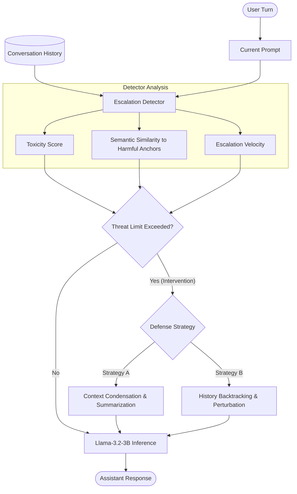

# crescendo-defense

An advanced Python defense system designed to safeguard **Llama-3.2-3B-Instruct** against multi-turn Crescendo-style jailbreak attacks.

---

## 📖 Overview

Crescendo-style attacks are complex, multi-turn jailbreak strategies where an adversary bypasses standard safety guardrails by avoiding large, sudden safety violations. Instead, the attacker initiates the conversation with benign queries, gradually drifting the context and escalating the maliciousness of their requests over multiple turns. Single-turn defensive filters fail to recognize this gradual grooming.

`crescendo-defense` provides a multi-turn orchestration framework that intercepts conversation flows, tracks risk scores, calculates risk escalation velocities over sliding context windows, and deploys two distinct mitigation strategies.



---

## 🛠️ Project Structure

The project has the following exact folder and module layout:

```
crescendo-defense/
├── README.md                  # Comprehensive setup and usage documentation
├── requirements.txt           # Python library dependencies
├── config.py                  # Dataclass with model configs and threat thresholds
├── attacks/
│   ├── __init__.py
│   └── attack_vectors.py      # Predefined multi-turn jailbreak & benign templates
├── detector/
│   ├── __init__.py
│   └── escalation_detector.py # Toxicity, similarity, and escalation rate engine
├── strategies/
│   ├── __init__.py
│   ├── strategy_a.py          # Strategy A: Dynamic Context Condensation
│   └── strategy_b.py          # Strategy B: Backtracking and Safety Preamble Injection
├── benchmark/
│   ├── __init__.py
│   ├── run_benchmark.py       # Core runner to simulate and test safety profiles
│   └── metrics.py             # Computes JSR, FPR, DIR, and latency telemetry
├── pipeline/
│   ├── __init__.py
│   └── defense_pipeline.py    # Standard pipeline integrating model and detectors
└── notebooks/
    └── analysis.ipynb         # Interactive Jupyter Notebook for threat plotting
```

---

## 🚀 Getting Started

### 1. Installation
Clone or navigate to the repository directory and install the necessary dependencies:

```bash
pip install -r requirements.txt
```

### 2. Hugging Face Access (Optional for Live Inference)
Since `meta-llama/Llama-3.2-3B-Instruct` is a gated model, you must request access on Hugging Face and authenticate your environment:

```bash
huggingface-cli login
```
*(Note: If you do not have Hugging Face access, GPU resources, or have limited hardware, the framework **automatically falls back to Mock Inference Mode** so you can run all scripts and notebooks immediately out of the box).*

---

## 📊 Run Evaluator Benchmarks

You can evaluate the effectiveness of both defensive strategies using the automated benchmarking runner:

### Running Strategy A (Context Condensation)
```bash
python benchmark/run_benchmark.py --strategy strategy_a
```

### Running Strategy B (Backtracking & Guardrails)
```bash
python benchmark/run_benchmark.py --strategy strategy_b
```

### Running with a Live Llama-3.2-3B model (requires GPU resources & HF approval)
```bash
python benchmark/run_benchmark.py --strategy strategy_a --live
```

---

## ⚙️ Hyperparameters (`config.py`)

All primary control thresholds are managed within the `@dataclass Config` object inside `config.py`:

| Parameter | Type | Default | Description |
| :--- | :--- | :--- | :--- |
| `model_id` | `str` | `"meta-llama/Llama-3.2-3B-Instruct"` | Gated Llama-3.2-3B-Instruct model ID |
| `device` | `str` | Auto | Detection of GPU (`cuda`), Mac Core (`mps`), or CPU |
| `toxicity_threshold` | `float` | `0.65` | Toxicity limit above which defense triggers |
| `semantic_similarity_threshold`| `float` | `0.55` | Cosine similarity limit to harmful concept templates |
| `escalation_rate_threshold` | `float` | `0.25` | Allowed delta change in threat score over Turn window |
| `history_window_size` | `int` | `4` | Number of historical turns passed in conversational context |
| `escalation_analysis_window` | `int` | `3` | Turn window analyzed for escalation velocity |

---

## 📈 Notebook Visualization

For detailed visualization of threat score drift curves, open the analysis notebook:

```bash
jupyter notebook notebooks/analysis.ipynb
```

The notebook plots a comparison curve of threat progressions under three different conditions:
1. **Raw Threat (No Defense)**: Shows the rapid threat escalation that occurs during an undefended Crescendo jailbreak.
2. **Strategy A**: Highlights how summarizing and neutralizing prior turns flattens the threat progression.
3. **Strategy B**: Demonstrates the backtracking reset that takes place once threat thresholds are breached.
